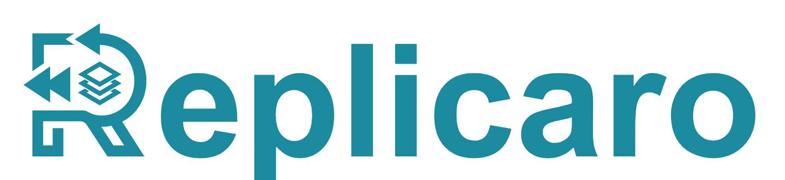
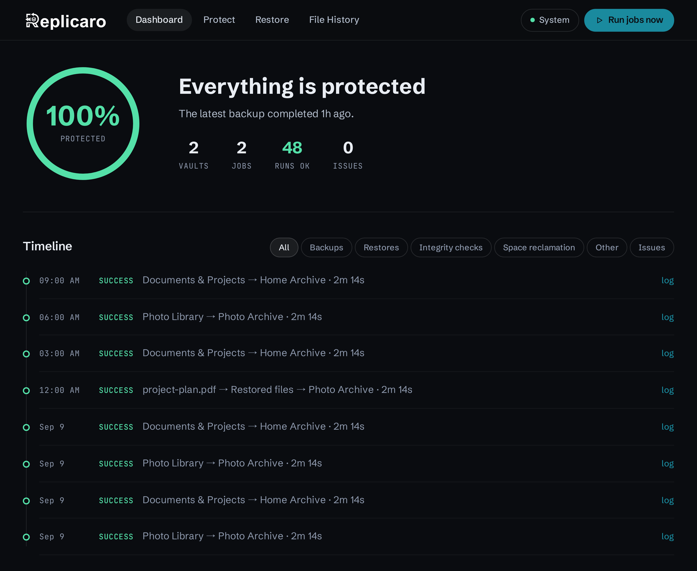
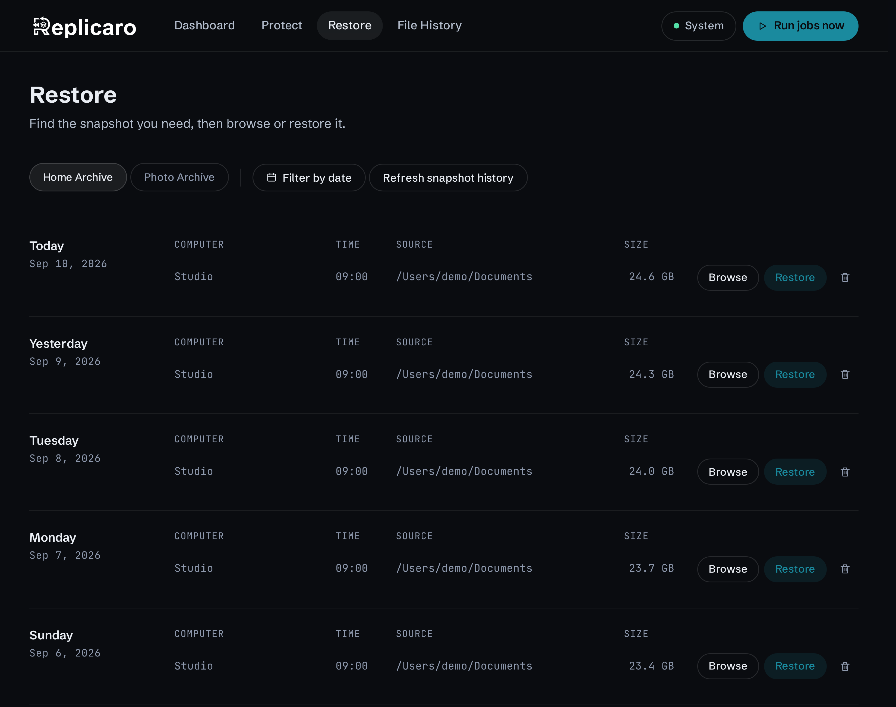
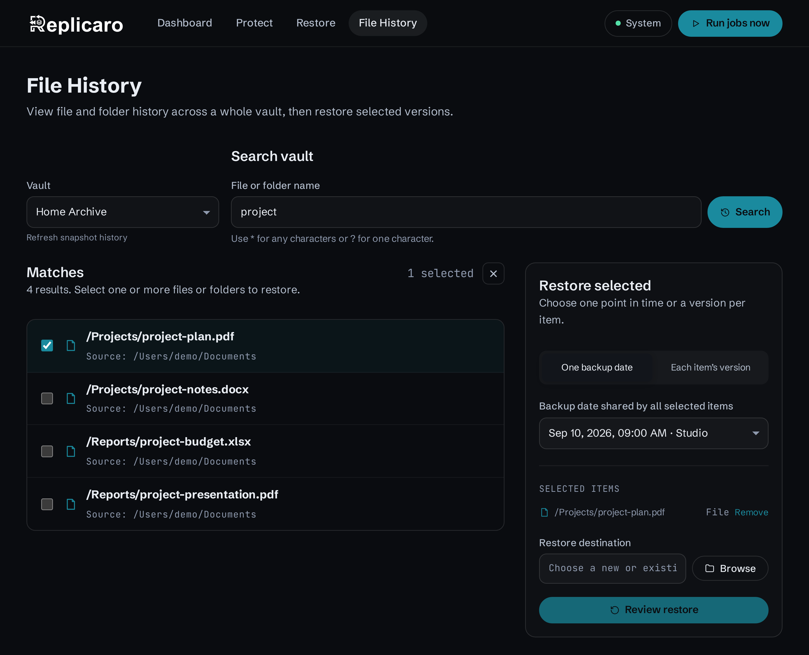
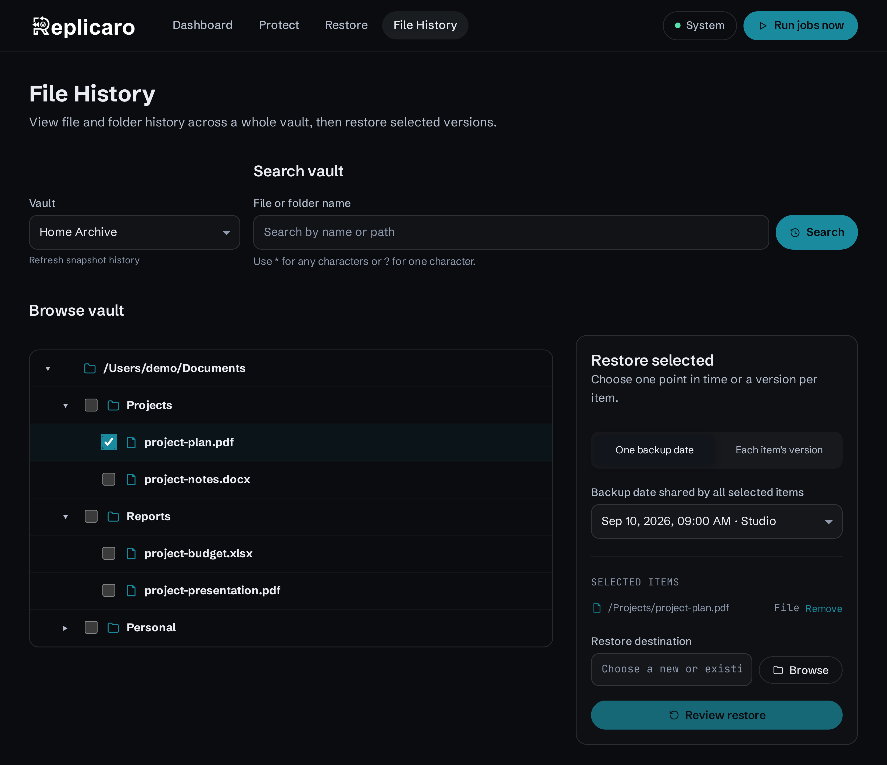
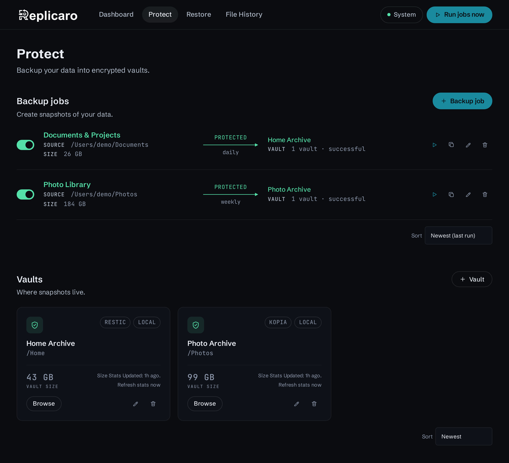
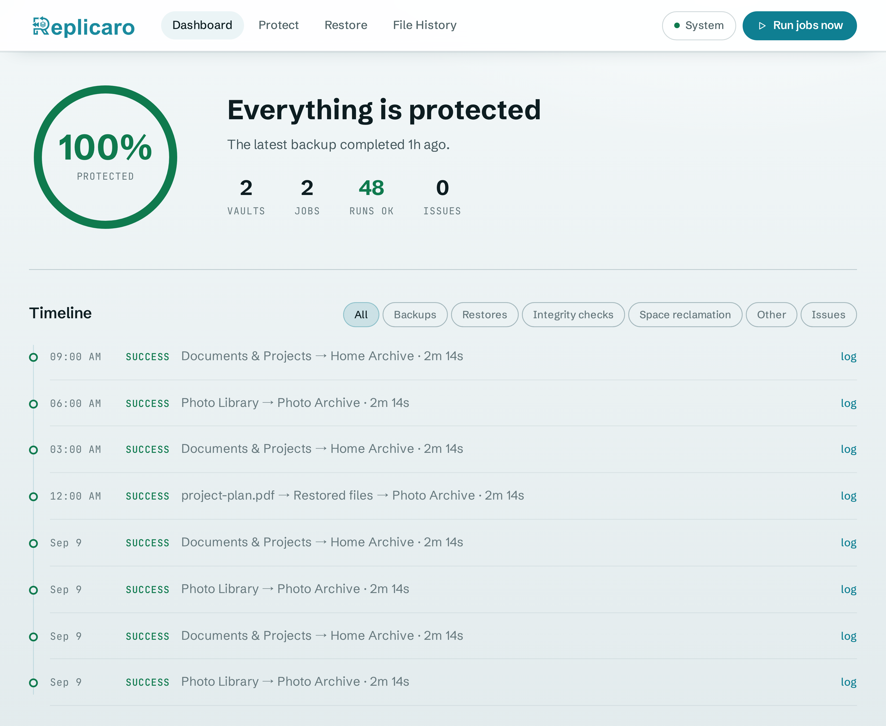
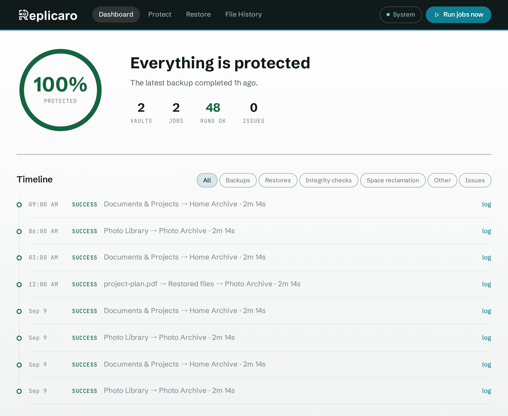

<div align="center">
  

  <h3>Effortless backups with complete file history</h3>

  <p>
    A modern, easy-to-use backup experience powered by
    <a href="https://github.com/restic/restic" target="_blank">Restic</a> and
    <a href="https://github.com/kopia/kopia" target="_blank">Kopia</a>
  </p>
  
  <p>
    See more at <a href="https://replicaro.com" target="_blank">replicaro.com</a> or try the <a href="https://replicaro.com/demo/" target="_blank">interactive demo</a>
  </p>

  <p>
	<a href="https://github.com/replicaro/replicaro/releases" target="_blank"></a>
    <a href="https://github.com/replicaro/replicaro/releases" target="_blank"></a>
    <a href="https://github.com/replicaro/replicaro/releases" target="_blank"></a>
    <a href="https://hub.docker.com/r/replicaro/replicaro/" target="_blank"></a>
  </p>
</div>



Replicaro combines powerful backup engines with a calm, approachable experience. Create encrypted cloud or local vaults, schedule automatic backups of local or network files, easily find old versions of files, and restore what matters. All from one modern interface.

Use for home or work. 
Use on laptops, desktops, or servers (including self-hosting). 
Use in Windows, Mac, Linux, or Docker.

File history. Automation. End-to-end encryption. Compression. Deduplication. Use your own cloud, local, or network storage. Replicaro has got it all.

## Backups Made Easy

Creating backups should be easy. Replicaro makes it easy. Get started in five minutes or less, or your money back!

<table width="100%">
  <tbody>
    <tr>
      <td width="333" valign="top">
        <strong>① Create a vault</strong><br><br>
        Choose the local, network, or cloud storage where your backups will live. You control the storage.
      </td>
      <td width="333" valign="top">
        <strong>② Create a backup job</strong><br><br>
        Pick the files you want to protect and send them to one or more vaults. Mix and match local, remote, Restic, and Kopia vaults as you see fit.
      </td>
      <td width="334" valign="top">
        <strong>③ Sit back and relax</strong><br><br>
        Replicaro backs up your data automatically on your schedule.
      </td>
    </tr>
  </tbody>
</table>

## Restoring Made Easier

Deleted the wrong file? Saved over an important document? You should not have to remember which backup contains the version you need. Replicaro's File History lets you find files by name or path, view complete file history, and choose which file version to restore. Restore one file/folder or several selected files or folders, with each having its own history. The choice is yours.

Whole snapshot restore is supported too, of course.

### Snapshots

Backups in Replicaro are stored in snapshots. Browse a snapshot's contents before restoring it. Restore everything or pick one file.



### File History

View the history of your backed up files & folders, so you can restore specific versions rather than digging through snapshots to find what you need.

#### Search Across File History

Search by name or path, compare available versions, select multiple files or folders, and restore.



#### Browse File History

Don't want to search? No problem. You can also explore a vault just like a folder tree. Expand backed up sources and directories, select files or entire folders as you go, and recover the versions you need -- without having to remember an exact name.



## Your Data, Your Storage, Your Choice

<table width="100%">
  <thead>
    <tr>
      <th align="center" width="760">Destination Vaults</th>
      <th align="center" width="240">Supported by Replicaro</th>
    </tr>
  </thead>
  <tbody>
    <tr><td width="760">Dropbox</td><td align="center" width="240">✓</td></tr>
    <tr><td width="760">Google Drive</td><td align="center" width="240">✓</td></tr>
    <tr><td width="760">Microsoft OneDrive</td><td align="center" width="240">✓</td></tr>
    <tr><td width="760">All S3-compatible hot object storage (AWS, Backblaze B2, Wasabi, Cloudflare R2, MinIO, and more)</td><td align="center" width="240">✓</td></tr>
    <tr><td width="760">All S3-compatible cold object storage (AWS Deep Glacier, Scaleway Glacier, and more)</td><td align="center" width="240">✓</td></tr>
    <tr><td width="760">Azure Blob Storage</td><td align="center" width="240">✓</td></tr>
    <tr><td width="760">Google Cloud Storage</td><td align="center" width="240">✓</td></tr>
    <tr><td width="760">SFTP/SSH</td><td align="center" width="240">✓</td></tr>
    <tr><td width="760">Local, external, and mounted storage</td><td align="center" width="240">✓</td></tr>
  </tbody>
</table>

<table width="100%">
  <thead>
    <tr>
      <th align="center" width="760">Data That Can Be Backed Up</th>
      <th align="center" width="240">Supported by Replicaro</th>
    </tr>
  </thead>
  <tbody>
    <tr><td width="760">Files &amp; folders on your computer</td><td align="center" width="240">✓</td></tr>
    <tr><td width="760">Attached/removable/flash drives</td><td align="center" width="240">✓</td></tr>
    <tr><td width="760">Network files &amp; folders</td><td align="center" width="240">✓</td></tr>
    <tr><td width="760">Any files/folders that your computer can read: FUSE mounts, sshfs, etc.</td><td align="center" width="240">✓</td></tr>
  </tbody>
</table>

All data in all vaults is always encrypted, compressed, and deduplicated.

## Protect what matters

Build backup jobs around your data. No need to understand command-line.



- Send one job to one or several vaults. Mix and match local, remote, Restic, and Kopia vaults to build the protection strategy that fits you.
- Use whatever automatic backup schedule that floats your boat.
- Select a simple or granular snapshot retention strategy.
- Exclude files and folders you do not need.
- Tune performance to make backups faster or slower.
- Add before- and after-backup scripts for local workflows.

## More than a scheduler

- **Pick your backup engine.**

  - Restic is great. Kopia is great. Why should you be forced to use only one? Replicaro allows you to pick whatever backup engine you want. You can also easily import existing Restic or Kopia repositories.

- **Multi-vault backups made easy.**

  - Pick as many vaults as you want for one backup job to save into. Mix and match local, remote, Restic, and Kopia vaults. No problem.

- **Simple + advanced scheduling and retention.**

  - Setting a backup schedule and snapshot retention policy should not. Be. Rocket. Science. Replicaro has both simple and advanced scheduling and retention options; most users will appreciate the simplicity while advanced users will appreciate the optional granularity.
  
- **Removable and network storage detection.**

  - If your source data or destination vault is removable/external/flash storage or a network location, Replicaro automatically pauses backup jobs when that removable or network storage is unavailable and automatically resumes jobs when it becomes available. Yes, Replicaro works even when the namespace (e.g., drive letter) of your removable/external/flash storage changes. It is like magic.

- **Object lock & immutability.**

  - Vaults on S3-compatible storage, Azure, and Google Cloud can use object lock to prevent ransomware attacks or accidental deletions.

- **Notifications of failure and success.**

  - Enable desktop notifications or webhooks to be notified of job failures and/or successes.

- **Tray icons.**

  - Replicaro has Windows system tray, macOS menu bar, and Linux notification area icons that allow you to easily launch the interface.

- **Backup multiple computers to the same vault.**

  - Use the same vault for up to 256 computers-at the same time! There is no server-client archiecture needed. You do not need to do anything special: just connect each computer to the vault, set up backup jobs on each computer, and Replicaro does its thing. (Note: Multi-computer vaults are not supported on Dropbox, Google Drive, and OneDrive vaults. You can use one Dropbox, Google Drive, or OneDrive account to hold multiple vaults, but each vault can only be used by one computer.)

- **Bring an existing vault.**

  - Connect an existing Restic or Kopia repository and keep its backed up data in place. Go back to Restic or Kopia if you change your mind. (Note: Replicaro does not delete or modify your backed up Restic or Kopia data. But Replicaro does edit Kopia policies, so if you decide to go back to Kopia you will need to remake your policies. Your data is untouched.)

- **Easily reconnect jobs for recovery or on another computer.**

  - Replicaro encrypts and stores your backup job settings in the vault. This makes it super easy to recover your data after a cyberattack, a crash, or to set Replicaro up on another computer.

- **Check backup integrity.**

  - A backup is only as good as your ability to recover it. Run or schedule integrity checks easily with Replicaro.

- **Follow work as it happens.**

  - See queued and active operations, live progress, completed results, and operation logs.

- **Keep an eye on capacity.**

  - Replicaro shows you job and vault sizes. It is literally right there.
  
- **Fully tested end-to-end before each release.**

  - Before every release, we test Replicaro features end-to-end on Windows, Mac, Linux, and Docker to ensure they are working as intended. While we cannot promise zero bugs (all software have bugs), this mean you have a better experience using Replicaro and have to worry a bit less about your backups.
  
- **Byte-per-byte reproducible.**

  - Open source projects are great because you get to inspect the code. It helps build trust. But being able to see the code, such as on Github, does not mean the app you download matches exactly that code. That is why we have made Replicaro byte-per-byte reproducible: you can compile Replicaro's code yourself using the scripts we have included, and the binaries you generate will match exactly the unsigned binaries released on Github. Trust but verify, right? Our signed binaries are the same unsigned binaries you see but with our code signing applied.

- **Multi-language and internationalization support.**

  - English not your prefered language? No problem. Replicaro also supports Arabic (Modern Standard), Bengali, Brazilian Portuguese, Cantonese (Traditional Chinese), Dutch, European Portuguese, French, German, Greek, Hebrew, Hindi, Indonesian, Irish, Italian, Japanese, Korean, Malaysian Malay, Mandarin (Simplified Chinese), Nigerian Pidgin, Persian (Farsi), Polish, Russian, Spanish, Turkish, Urdu, and Vietnamese.

- **Make the interface yours.**

  - Dark, Light, and Neutral themes make Replicaro comfortable on any desktop.

### Light



### Neutral



<div align="center">
  <strong>Your data. Your storage. Your protection.</strong>
</div>

## Translate Replicaro

The canonical English interface catalog is at
[`code/frontend/public/locales/en.json`](code/frontend/public/locales/en.json).
Translations are contributed through pull requests and require review before
they are included in the app. A new catalog is a candidate until a maintainer
explicitly registers its locale in the frontend catalog registry, backend
catalog loader, and supported language setting. The v1.0.2 source includes
English, German, French, Arabic, Urdu, Hindi, Spanish, Italian, Simplified
Chinese (Mandarin), Traditional Chinese (Cantonese), Japanese, Irish, Korean,
Malay, Indonesian, Turkish, Hebrew, European Portuguese, Brazilian Portuguese,
Russian, Polish, Dutch, Bengali, Greek, Persian (Farsi), Vietnamese, and Nigerian
Pidgin. The new translations require fluent-speaker and maintainer approval
before release. Updates to an already registered
translation can remain catalog-only.
New catalogs must also be included in the
[`public-source manifest`](code/build/unsigned/public-source-v1.json) so public
builds receive the same translations as internal builds.

English is the source of truth for every translation. Preserve its meaning,
including the strength of claims, warnings, qualifications, and uncertainty.
If an English statement seems incorrect or overstated, raise that as a separate
source-text issue; do not silently correct, weaken, or strengthen it in another
language. Natural phrasing and the target language's grammar should convey the
same message.

The shared English catalog serves both British and American English. Regional
Spanish, French, and other OS language variants use their shared language
catalog when no exact regional catalog is registered. European Portuguese
(`pt-PT`) and Brazilian Portuguese (`pt-BR`) have separate catalogs. Matching
tries an exact locale, then progressively less specific tags, then a registered
variant of the same language before moving to the next OS preference; English
is the final fallback. Same-language variant fallback uses sorted catalog order,
so `pt` and `pt-AO` currently select `pt-BR`. Users can choose a specific catalog
in Appearance. Text and formatting both use the selected catalog's locale;
there is no separate regional-format setting.

The language area always includes **Reset to English**, with that exact English
label excluded from translation. It saves the English preference immediately;
other unsaved settings stay in the form until the user saves them separately.

Arabic (`ar`) uses Modern Standard Arabic, Persian (`fa`) uses standard Iranian
Persian, Malay (`ms`) uses Malaysian Malay, and Pidgin (`pcm`) uses Nigerian
Pidgin. Mandarin (`zh-Hans`) uses Simplified Chinese; Cantonese (`yue-Hant`)
uses Traditional Chinese. OS tags beginning with `zh` select Mandarin, including
Traditional Chinese OS settings; Cantonese requires a `yue` tag or an explicit
selection. These catalogs are not automatic script or dialect conversions.

All Replicaro-formatted dates use the **Gregorian calendar** in every language,
including Arabic and Persian. Month names, digits, field order, and time
formatting use the selected locale through the browser's `Intl` data. A browser
that lacks formatting data for a locale may use its default locale for dates
and numbers; the calendar stays Gregorian. Use `formatDisplayDate` or
`formatDisplayDateTime` from `code/frontend/src/i18n.ts` for UI dates so locale
defaults cannot switch the calendar. This applies to snapshot dates, activity and profile timestamps,
and date-picker labels. It does not rewrite stored timestamps, time zones, raw
engine output, or native retention calendar semantics. Support-report payloads
remain English, including when their surrounding UI is translated.

1. Fork the [public Replicaro repository](https://github.com/replicaro/replicaro)
   and create a branch in your fork.
2. Copy `code/frontend/public/locales/en.json` in the same directory. Name the
   copy for the correct BCP 47 locale identifier, such as `fr-FR.json`. Use a
   hyphen between language and region subtags, rather than an underscore.
   Set the top-level `locale` to that identifier and `direction` for the language.
   The bundled Arabic, Urdu, Hebrew, and Persian catalogs use `rtl`; the other
   bundled catalogs use `ltr`.
3. Translate the values. Keep every message key and placeholder exactly as in
   `en.json`; do not add or remove message keys. Preserve interpolation syntax.
   For plural messages, use the categories required by the target locale, which
   can differ from English (`one` and `other`); the locale validator checks them.
4. Keep **Replicaro**, **Restic**, **Kopia**, and **rclone** unchanged. Preserve
   user-provided names, paths, commands, configuration values, and log samples.
   These are data, not prose to translate.
5. Write complete, natural sentences in the target language. Check labels and
   messages in context, especially at narrow window widths. Do not put raw
   HTML, scripts, or external links in catalog values.

The public translation PR check runs these commands. Run them locally from
`code/frontend` before opening a pull request:

```sh
npm ci
npm run validate:locales
npm run build
```

Open a pull request against the public repository. State the language and
exact locale identifier, how a fluent speaker reviewed the wording, and include
screenshots of representative screens at desktop and narrow widths. A fluent
speaker and a maintainer must review the translation before it ships. Updates
to an existing translation normally change only that locale's catalog and any
bounded metadata needed for it; explain any broader change in the pull request.

## License

Replicaro's first-party application source and release binaries are licensed under
the [Apache License 2.0](LICENSE). Bundled third-party components retain their
own licenses; their notices are included in each release package's `LICENSES.txt`.
